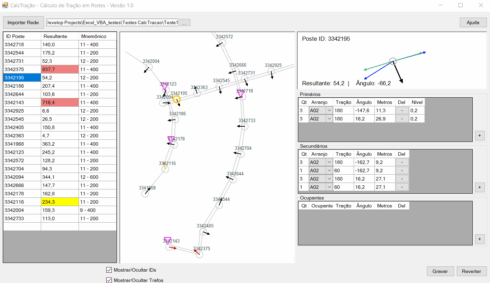
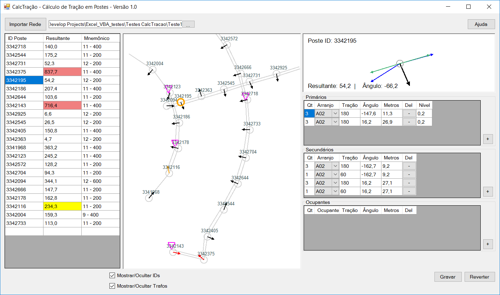

# Wires Structural Load on Poles
A GIS Analyzer for Wires Structural Load on Poles.


# Project Overview
This project was made during an internship to facilitate the work of analysis of structural load on poles taking in consideration the disponibility, amount, and characteritics of overhead wires on poles.
The system uses GIS structured data to process the values and plots it with the possibility to manipulate the data while viewing the grid structure.
OBS.: This system was written to use structured GIS data and lat/long position values. The primary and secondary conductors files have the id of each pole that they are attached to in the correct order. There is an example of input data on the project.

## Input GIS Data
Four txt files placed in the same directory are needed as inputs of the system, those are responsible to store data and position of the elements and should be named acordingly and have the structure as shown below:
* Primary conductors: "ed_oh_primary_conductor.txt"
```
id|arranjo|anchor_id_1|anchor_id_2|route
5912142|3A02|3342644|3342544|29285174.000|747461536.000|29283458.000|747458338.000
5911531|3A02|3342178|3342116|29276494.000|747462830.000|29277586.000|747465976.000
```
* Secondary conductors: "ed_oh_secondary_conductor.txt"
```
id|arranjo|usage|anchor_id_1|anchor_id_2|route|||
19557172|3A2/0(A1/0)|Secundário|3342666|3342572|29285837.000|747475255.000|29284149.000|747478865.000
19557204|3NCNC(NCNC)|Serviço|3342666||29286491.000|747475560.000|29285837.000|747475255.000
```
* Transformers: "ed_oh_transformer.txt"
```
location
29277166.000|747453086.000|
29286461.000|747471903.000|
```
* Poles: "ed_pole.txt"
```
id|height|formato|material|owner_type|owner_name|strength|location|status|
3342718|11|Circular|Concreto|Próprio|Paulista|400|29286709.000|747471969.000|Existente
3342544|11|Circular|Concreto|Próprio|Paulista|200|29283726.000|747458122.000|Existente
```

## Input Wire Load Data
The system uses mnemonics to identify the wire types, and need a single file with the mnemonics and the load values for some lengths: until 35m, from 35m to 40m, from 40m to 80m and 80m to 120m. 
* Wires Mnemonic: "MnemonicoDeCabos.txt"
```
Arranjo	35	40	80	120
E35	187	187	448	448
P25	96	96	96	96
P70	216	216	216	216
A1/0	96	96	186	186
A2/0	121	121	220	220
```

# Usage
## Importing Data
The system analyzes the data once the path to the GIS data is placed or selected on the top text field and the button "Importar Rede" is pressed.
## User Interface

### Window 1
List of poles with resultant load and mnemonic description.
* Yellow for resultant load 50daN higher than pole nominal load;
* Red for resultant load higher that pole nominal load plus 50daN.
Allows click to mark pole on **Window 2**.
### Window 2
Geographic representation of the grid. Allow left click on pole, move using right and zoom on scroll. Clicking on the pole will list the conductors on **Window 4**.
### Window 3
Vetorial representation of the conductors on the selected pole.
* Blue, primary conductors, level 1;
* Green, secondary conductors, level 2;
* Gray, occupancy, level 3;
* Black/Yellow/Red, resultant load.
### Window 4
Conductors description. Allows changing the values, remove (button "-") or add (button "+") conductors.

